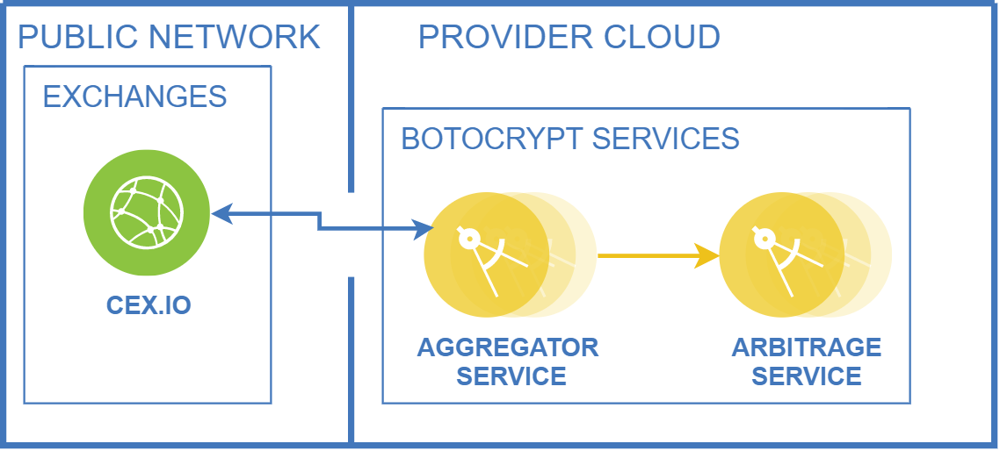

# Data Aggregator Service

A part of the botocrypt platform, the main purpose of this service is to collect all necessary data from cryptocurrency exchanges regarding specific cryptocurrencies, their prices and rest of their data. When they are collected, together they are sent to the **arbitrage service**.

## Architecture overview

An overview of Botocrypt architecture looks something like this:



The main purpose of Aggregator service is to fetch all necessary data regarding cryptocurrencies from exchanges (their prices, matching pairs...), group and send them to the Arbitrage service. There is no advanced logic or any other calculation happening in this service.

## Registered exchanges

Exchanges from where Aggregator service receives cryptocurrency orders are:

* [CEX.IO](https://cex.io/)

## Registered currencies

Currencies with which Aggregator service works are:

* BTC
* USD

## Technology Stack

### Data

|                 Technology                                               |                              Description                        |
|--------------------------------------------------------------------------|-----------------------------------------------------------------|
|<a href="https://flywaydb.org/">Flyway</a>                                |Version control for database                                     |
|<a href="https://www.mysql.com/">MySQL</a>                                |Open-Source Relational Database Management System                |
|<a href="https://www.h2database.com/html/main.html">H2 Database Engine</a>|Java SQL database. Embedded and server modes; in-memory databases|

### Server

|                                            Technology                                               |                              Description                                     |
|-----------------------------------------------------------------------------------------------------|------------------------------------------------------------------------------|
|<a href="http://www.oracle.com/technetwork/java/javase/downloads/jdk8-downloads-2133151.html">JDK</a>|Java™ Platform, Standard Edition Development Kit                              |
|<a href="https://spring.io/projects/spring-boot">Spring Boot</a>                                     |Framework to ease the bootstrapping and development of new Spring Applications|
|<a href="https://gradle.org/">Gradle</a>                                                             |Build Tool                                                                    |

###  Libraries and Plugins

* [Quartz](http://www.quartz-scheduler.org/) - Open source job scheduling library that can be integrated within virtually any Java application.
* [Swagger](https://swagger.io/) - Open-Source software framework backed by a large ecosystem of tools that helps developers design, build, document, and consume RESTful Web services.
* [Lombok](https://projectlombok.org/) - Never write another getter or equals method again, with one annotation your class has a fully featured builder, Automate your logging variables, and much more.
* [gRPC](https://grpc.io/) - Modern open source high performance Remote Procedure Call (RPC) framework that can run in any environment. It can efficiently connect services in and across data centers.
* [gRPC Mock](https://github.com/Fadelis/grpcmock) - A gRPC Java testing tool to easily mock endpoints of gRPC services for IT or Unit testing. The tool follows a similar DSL type of structure to HTTP mocking service WireMock.
* [Mockito](https://site.mockito.org/) - Open source testing framework for Java which allows the creation of test double objects (mock objects) in automated unit tests for the purpose of test-driven development (TDD) or behavior-driven development (BDD).
* [WireMock](http://wiremock.org/) - Simulator for HTTP-based APIs. It constructs a HTTP server that we could connect to as we would to an actual web service. When a WireMock server is in action, we can set up expectations, call the service, and then verify its behaviors.

## Running the application locally

There are several ways to run a Botocrypt Aggregator service and initializer on your local machine.

Before starting Aggregator, it needs to be initialized with required data. It could be done by execute the `main` method in the `com.botocrypt.aggregator.InitRunner` with environment variable `SPRING_PROFILE=init` class from your IDE, or use [Spring Boot Gradle plugin](https://docs.spring.io/spring-boot/docs/current/reference/html/build-tool-plugins.html#build-tool-plugins-gradle-plugin) like so:

```shell
./gradlew bootRun --args='--spring.profiles.active=init'
```

Starting a service could be done by executing the `main` method in the `com.botocrypt.aggregator.Application` class from your IDE or running Gradle plugin command:

```shell
./gradlew bootRun
```
